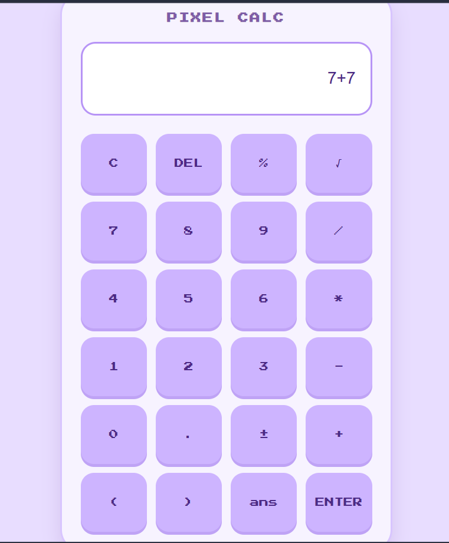
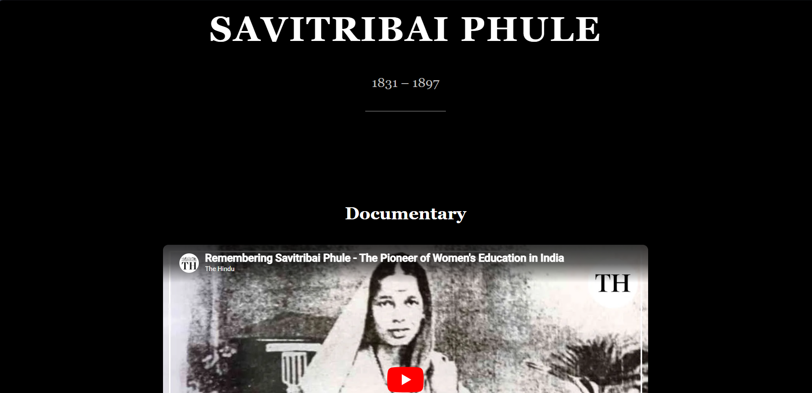
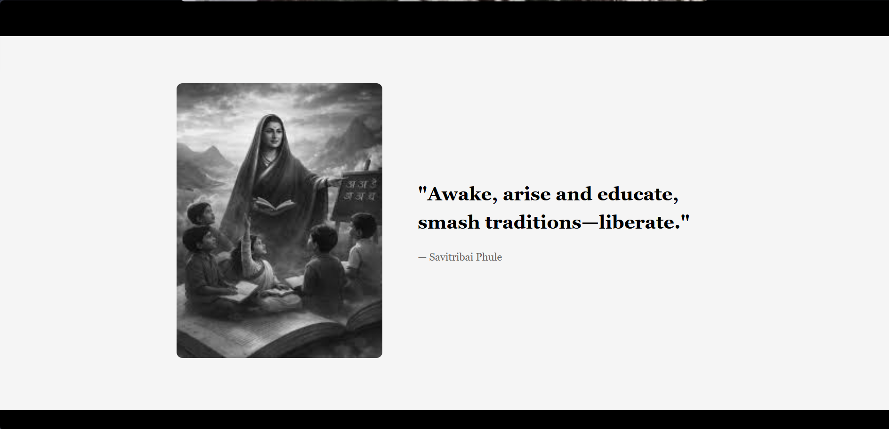
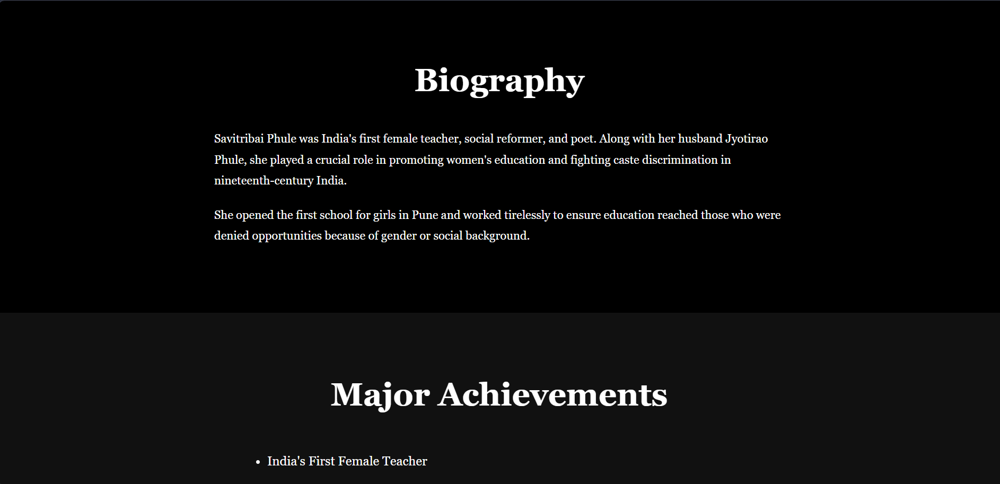
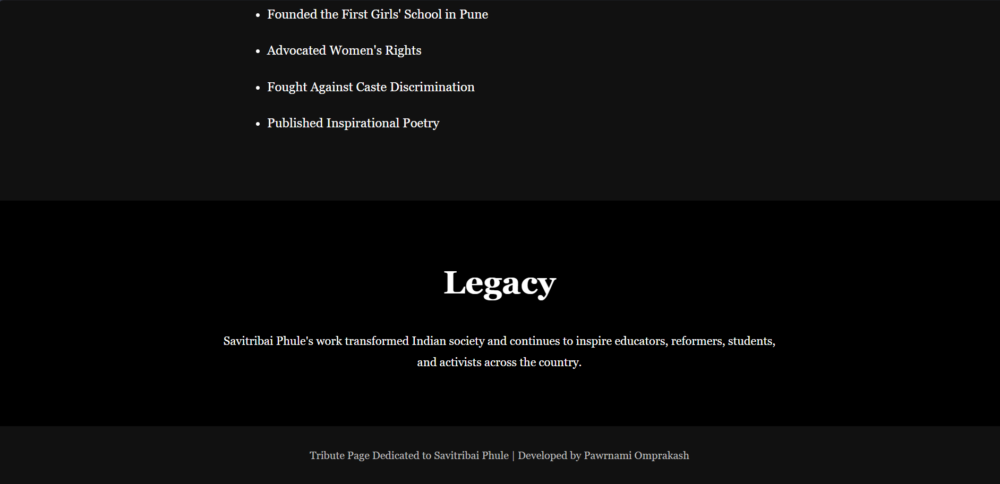
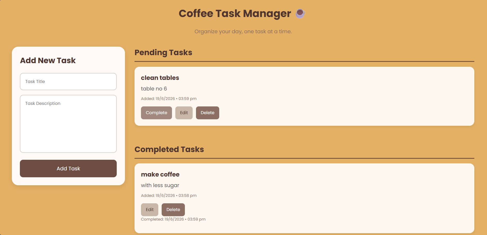
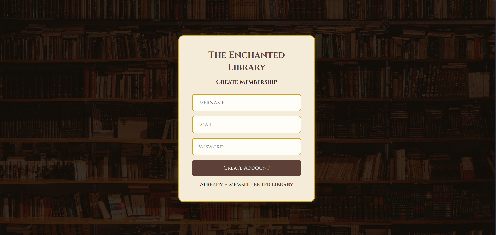
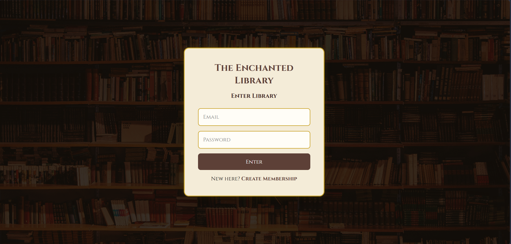

# Oasis Infobyte Level 2 Projects

This repository contains the projects completed as part of the **Oasis Infobyte Web Development Internship – Level 2**.

---

# 1. Calculator

A responsive calculator built using **HTML, CSS, and JavaScript**.

## Features

- Basic arithmetic operations
- Percentage calculation
- Square root calculation
- Responsive user interface

## Screenshot



---

# 2. Tribute Page

A tribute page dedicated to **Savitribai Phule**.

## Features

- Biography section
- Inspirational quotes
- Image gallery
- Achievements and legacy section
- Documentary video embed

## Screenshots

### Hero Section


### Biography Section


### Achievements Section


### Legacy Section


---

# 3. To-Do Web App

A task management application built using **HTML, CSS, and JavaScript**.

## Features

- Add tasks
- Edit tasks
- Delete tasks
- Mark tasks as completed
- Separate Pending and Completed sections
- Date and time tracking

## Screenshot



---

# 4. Login Authentication System

A full-stack authentication system with secure user authentication and authorization.

## Frontend

- HTML
- CSS
- JavaScript

## Backend

- Node.js
- Express.js
- MongoDB Atlas
- JWT Authentication
- bcrypt Password Hashing

## Features

- User Registration
- User Login
- Protected Dashboard
- JWT Authentication
- Secure Password Storage
- MongoDB Database Integration

## Screenshots

### Registration Page


### Login Page


### Dashboard


---

# Technologies Used

- HTML5
- CSS3
- JavaScript
- Node.js
- Express.js
- MongoDB Atlas
- JWT
- bcrypt

---

# Repository Structure

```text
LEVEL2/
│
├── calculator/
├── login auth/
├── todo-app/
├── tribute page/
├── screenshots/
└── README.md
```

---

# Author

**Pawrnami Omprakash**

Oasis Infobyte Web Development Internship – Level 2
